# 🚀 CareerPilot AI

> An AI-powered multi-agent career copilot that helps students optimize resumes, analyze ATS scores, identify skill gaps, prepare for interviews, generate personalized learning roadmaps, and accelerate their job search.


---

# 📖 Table of Contents

- About
- Features
- Tech Stack
- System Architecture
- Folder Structure
- Installation
- Environment Variables
- API Endpoints
- AI Workflow
- Database
- Screenshots
- Future Enhancements
- License
- Author

---

# 📖 About

CareerPilot AI is an intelligent career guidance platform designed for students and fresh graduates.

Instead of using multiple websites for resume review, ATS analysis, interview preparation, skill-gap analysis, and career planning, CareerPilot AI brings everything together into a single AI-powered platform.

The system uses multiple specialized AI agents orchestrated through a central workflow to provide personalized career guidance.

---

# ✨ Features

## Resume Analysis

- Upload PDF resumes
- Automatic resume parsing
- Structured resume extraction
- Resume visualization

---

## ATS Analysis

- ATS Compatibility Score
- Missing keyword detection
- Resume improvement suggestions
- Recruiter-style feedback

---

## AI Career Report

- Resume summary
- Strength analysis
- Weakness analysis
- Skill gap analysis
- Career recommendations

---

## Resume Optimizer

- AI-powered resume improvements
- Better wording suggestions
- Action verb improvements
- ATS-friendly recommendations

---

## Job Recommendation

- AI job matching
- Personalized recommendations
- Skill-based recommendations

---

## Interview Preparation

- Technical interview questions
- HR interview questions
- Resume-based questions
- Personalized preparation

---

## Career Roadmap

- Weekly roadmap
- Learning path
- Skill recommendations
- Career milestones

---

## Dashboard

- Resume statistics
- ATS history
- Analytics
- Career history

---

## Analytics

- ATS trends
- Historical analysis
- Performance tracking

---

## History

- Previous reports
- Previous ATS analyses
- Previous career recommendations

---

# 🛠 Tech Stack

## Frontend

- Next.js 15
- React
- TypeScript
- Tailwind CSS

## Backend

- FastAPI
- Python 3.11
- SQLAlchemy
- Pydantic

## Database

- SQLite

## AI

- Groq
- OpenRouter (Optional)

## Development Tools

- VS Code
- Git
- GitHub
- npm
- pip

---

# 🏗 System Architecture

```

                    User
                      │
                      │
          Next.js Frontend (React)
                      │
                      │
              FastAPI Backend
                      │
                      │
      Career Copilot Orchestrator
                      │
 ───────────────────────────────────────────
 │ Resume Agent                           │
 │ ATS Analyzer                           │
 │ Resume Optimizer                       │
 │ Job Recommendation Agent               │
 │ Interview Preparation Agent            │
 │ Career Roadmap Agent                   │
 │ Career Report Generator                │
 ───────────────────────────────────────────
                      │
             Groq / OpenRouter
                      │
                SQLite Database

```

# 🏗 System Architecture 2

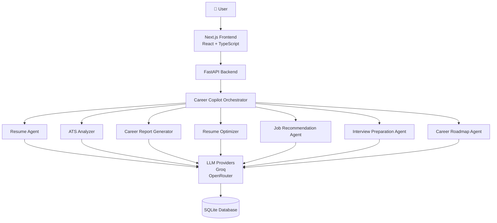

---

# 📂 Folder Structure

```

careerpilot-ai/

├── backend/
│   ├── agents/
│   ├── api/
│   ├── database/
│   ├── memory/
│   ├── models/
│   ├── orchestrator/
│   ├── providers/
│   ├── repositories/
│   ├── schemas/
│   ├── services/
│   ├── tools/
│   ├── use_cases/
│   └── utils/
│
├── web/
│
├── storage/
│   └── database/
│
├── docs/
│
├── scripts/
│
├── README.md
├── requirements.txt
├── pyproject.toml
└── .env.example

```

---

# 🚀 Installation

## Clone Repository

```bash
git clone https://github.com/Akhilsuram/careerpilot-ai.git

cd careerpilot-ai
```

---

## Backend

```bash
python -m venv .venv
```

Activate

Windows

```bash
.venv\Scripts\activate
```

Linux/macOS

```bash
source .venv/bin/activate
```

Install dependencies

```bash
pip install -r requirements.txt
```

---

## Frontend

```bash
cd web

npm install
```

---

## Configure Environment Variables

```
.env
```

Copy

```
.env.example
```

---

## Start Backend

```bash
uvicorn backend.main:app --reload
```

Backend

```
http://localhost:8000
```

---

## Start Frontend

```bash
cd web

npm run dev
```

Frontend

```
http://localhost:3000
```

---

# 🔑 Environment Variables

```
GROQ_API_KEY=

OPENROUTER_API_KEY=

DATABASE_URL=storage/database/careerpilot.db

NEXT_PUBLIC_API_URL=http://localhost:8000
```

---

# 🌐 API Endpoints

| Method | Endpoint | Description |
|---------|----------|-------------|
| POST | /resume/upload | Upload Resume |
| GET | /resume/latest | Get Latest Resume |
| POST | /ats/analyze | ATS Analysis |
| POST | /report/generate | Generate Career Report |
| POST | /jobs/recommend | Recommend Jobs |
| POST | /interview/questions | Interview Questions |
| POST | /roadmap/generate | Generate Career Roadmap |
| POST | /resume/optimize | Optimize Resume |
| GET | /analytics/dashboard | Dashboard Analytics |
| GET | /analytics/ats-history | ATS History |
| GET | /history | Career History |

---

# 🤖 AI Workflow

```

Upload Resume
      │
      ▼
Resume Parser
      │
      ▼
Structured Resume
      │
      ▼
ATS Analysis
      │
      ▼
Career Report
      │
      ▼
Resume Optimization
      │
      ▼
Job Recommendation
      │
      ▼
Interview Questions
      │
      ▼
Career Roadmap
      │
      ▼
Analytics & History

```

---

# 🗄 Database

Current database:

```
SQLite
```

Stores

- Resume Information
- ATS Reports
- Career Reports
- Job Recommendations
- Interview Questions
- Career Roadmaps
- Analytics
- History

---

# 📸 Screenshots

```
docs/screenshots/
```

```
dashboard.png

resume.png

ats.png

report.png

optimizer.png

jobs.png

interview.png

roadmap.png

analytics.png

history.png
```

```markdown
## Dashboard

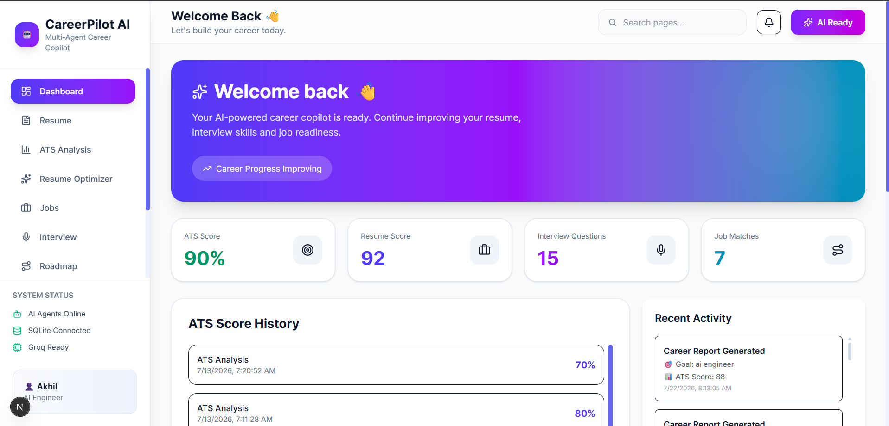

## Resume

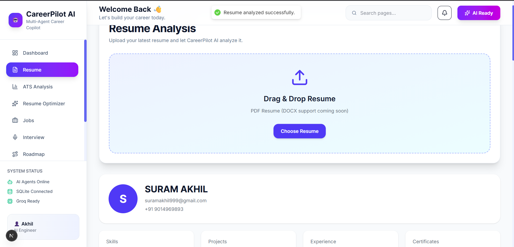

## ATS

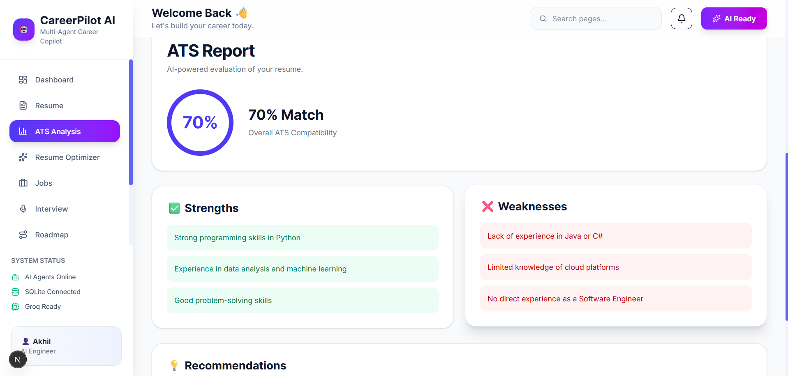

## AI Report

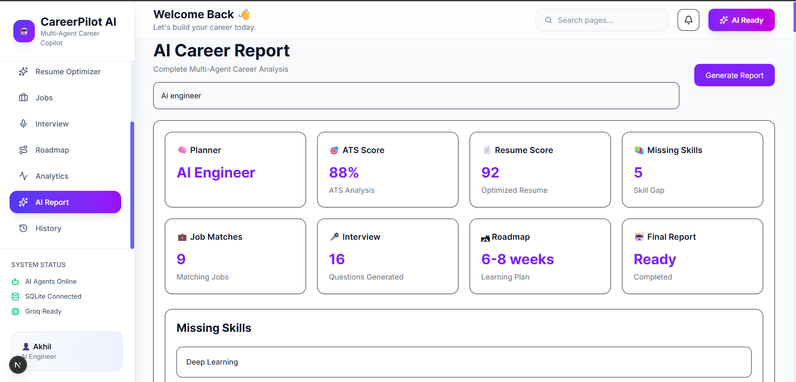

## Resume Optimizer

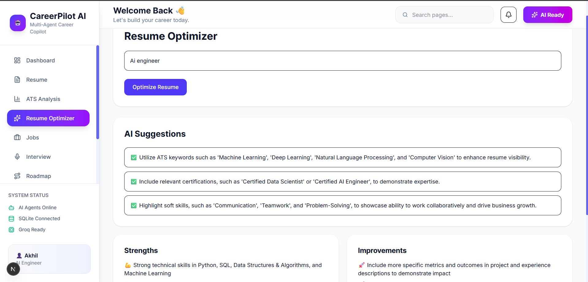

## Jobs

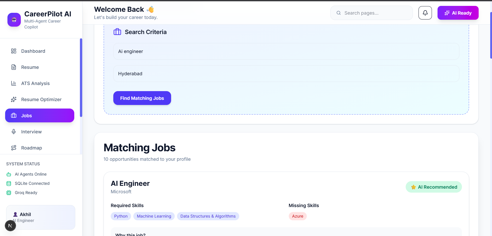

## Interview

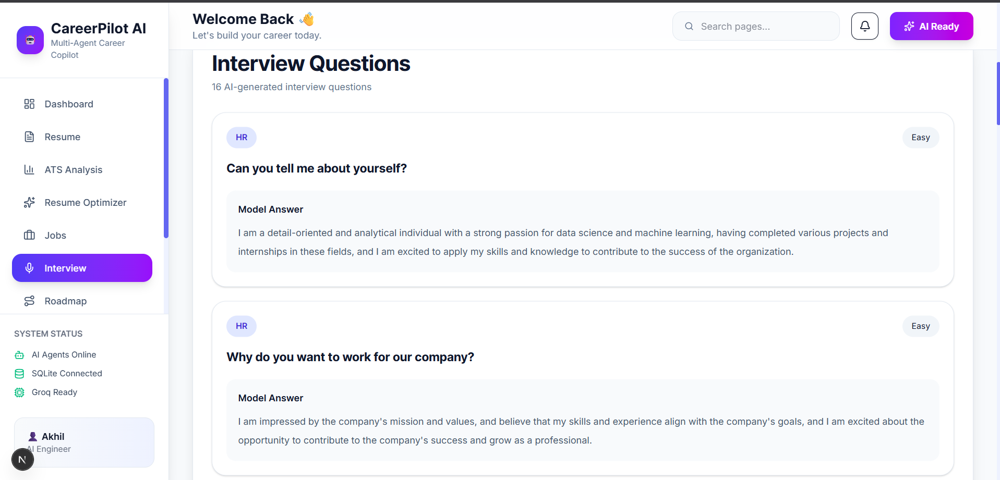

## Roadmap

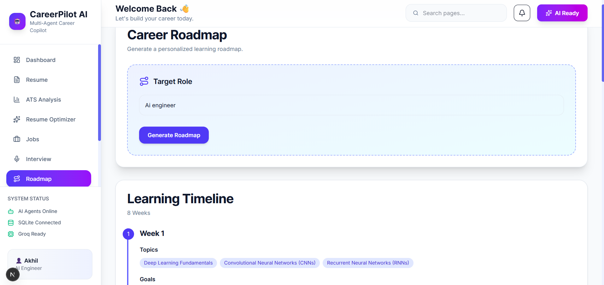

## Analytics

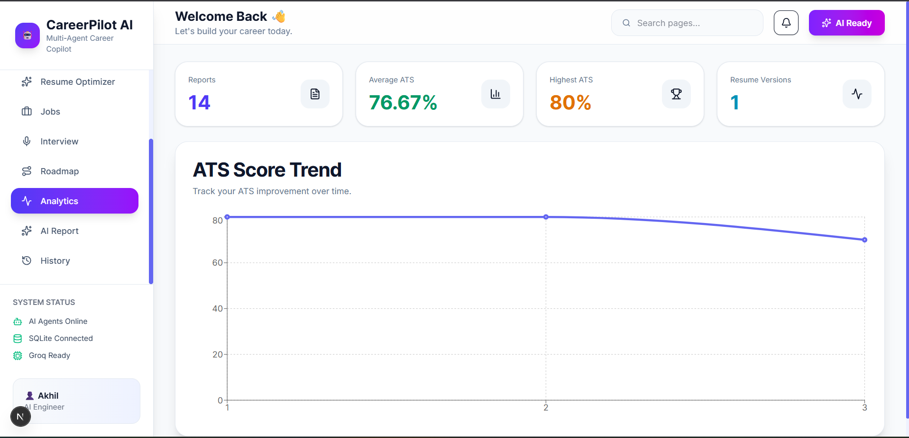

## History

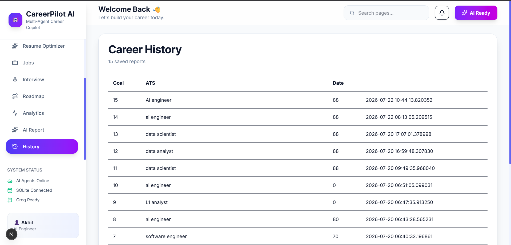
```

---

# 🚀 Future Enhancements

- User Authentication
- Mobile Responsive UI
- Cover Letter Generator
- Resume Versioning
- AI Chat Assistant
- Live Job APIs
- Email Notifications
- Docker Deployment
- PostgreSQL Support
- Multi-language Support
- Cloud Storage
- Team Collaboration
- Admin Dashboard

---

# 📄 License

This project is licensed under the MIT License.

---

# 👨‍💻 Author

**Suram Akhil**

- GitHub: https://github.com/Akhilsuram
- LinkedIn: https://linkedin.com/in/suramakhil

---

## ⭐ If you found this project useful, please consider giving it a star on GitHub.